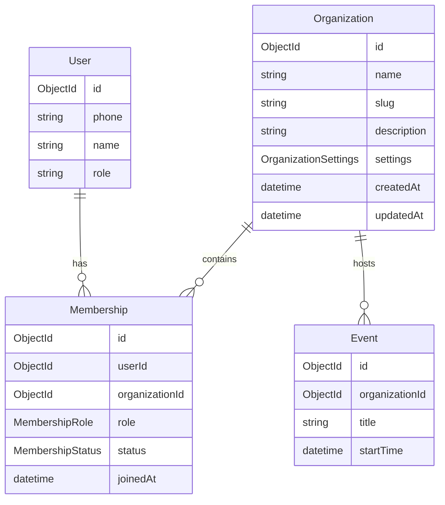
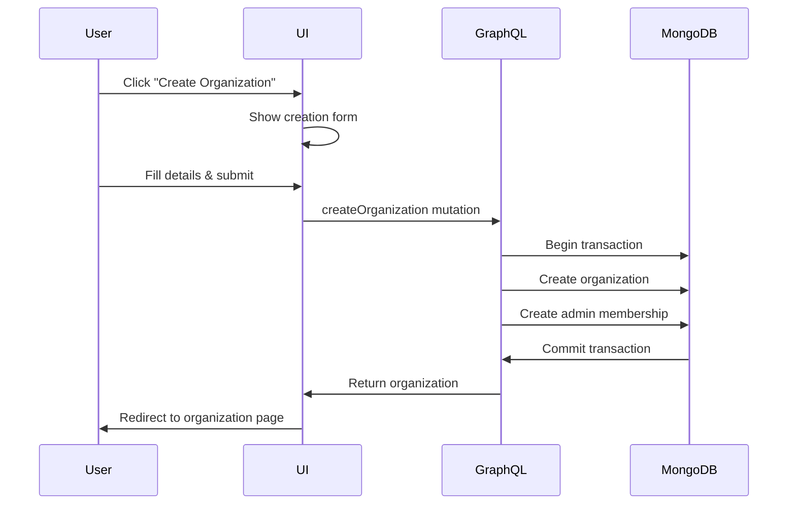
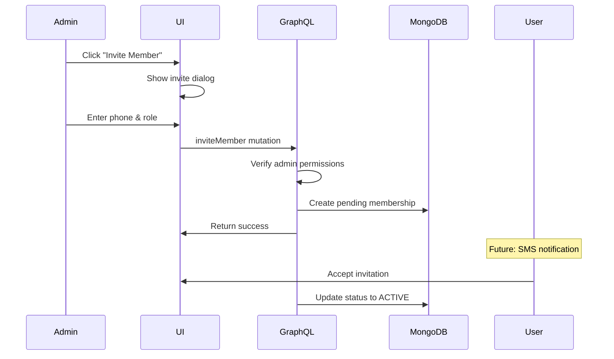
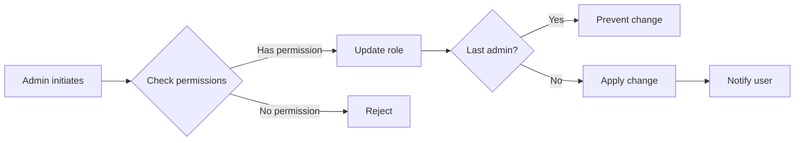

# Organization Management System Design

## Overview

The Organization Management System is a core feature of the Group Ops Platform that enables users to create, manage, and participate in organizations. Each organization serves as a container for events, members, and settings, with a comprehensive role-based access control system.

## Architecture

### Data Model



### Role Hierarchy

1. **ADMIN** - Full control over the organization
2. **MODERATOR** - Can manage events and moderate content
3. **MEMBER** - Basic member with limited permissions

### Status Types

- **ACTIVE** - Full member with active permissions
- **PENDING** - Invitation sent, awaiting acceptance
- **SUSPENDED** - Temporarily restricted access
- **BANNED** - Permanently restricted access

## Workflows

### Organization Creation Flow



### Member Invitation Flow



### Role Change Flow



## Permission Matrix

| Action | ADMIN | MODERATOR | MEMBER | Non-Member |
|--------|-------|-----------|---------|------------|
| **Organization Management** |
| Create Organization | ✅ | ✅ | ✅ | ✅ |
| Update Organization Settings | ✅ | ❌ | ❌ | ❌ |
| Delete Organization | ✅ | ❌ | ❌ | ❌ |
| View Organization Details | ✅ | ✅ | ✅ | Depends on visibility |
| **Member Management** |
| Invite Members | ✅ | ❌ | ❌ | ❌ |
| Remove Members | ✅ | ❌ | ❌ | ❌ |
| Change Member Roles | ✅ | ❌ | ❌ | ❌ |
| View Member List | ✅ | ✅ | ✅ | ❌ |
| Leave Organization | ✅* | ✅ | ✅ | N/A |
| **Event Management** |
| Create Events | ✅ | ✅ | Configurable** | ❌ |
| Update Events | ✅ | ✅ | Own events only** | ❌ |
| Delete Events | ✅ | ✅ | Own events only** | ❌ |
| View Events | ✅ | ✅ | ✅ | Depends on visibility |

*Cannot leave if last admin
**Configurable by admin in organization settings

## Security Considerations

### Permission Enforcement

1. **Backend Validation**: All mutations check permissions at the GraphQL resolver level
2. **Transaction Safety**: Organization creation uses MongoDB transactions to ensure atomicity
3. **Last Admin Protection**: System prevents removing or demoting the last admin
4. **Context-Based Auth**: User context from JWT determines permissions

### Data Access Control

```typescript
// Example permission check in GraphQL resolver
const membership = await db.collection('memberships').findOne({
  userId: new ObjectId(context.user.id),
  organizationId: orgId,
  role: 'ADMIN',
  status: 'ACTIVE'
});

if (!membership) {
  throw new Error('You must be an admin to perform this action');
}
```

## UI Components

### Organization List Page
- Grid view of all user's organizations
- Quick stats (members, events)
- Role badges for each organization
- Create new organization CTA

### Organization Detail Page
- **Header**: Name, description, role badge
- **Stats Cards**: Members, events, upcoming events
- **Tabs**:
  - Members: Table with management actions
  - Events: Event list and creation
  - Settings: Organization configuration (admin only)

### Member Management Table
- Avatar and user details
- Role badges with colors
- Status indicators
- Dropdown actions menu (admin only)
- Confirmation dialogs for destructive actions

### Create Organization Form
- Name with auto-generated slug
- Description (optional)
- Visibility settings
- Member approval toggle
- Guest RSVP permissions

## API Endpoints

### GraphQL Queries

```graphql
# Get user's organizations
query GetMyOrganizations {
  myOrganizations {
    id
    name
    slug
    stats {
      totalMembers
      totalEvents
    }
    myRole
  }
}

# Get organization details
query GetOrganization($slug: String) {
  organization(slug: $slug) {
    id
    name
    description
    settings {
      visibility
      requireApproval
      allowGuestRSVP
    }
    members {
      edges {
        node {
          id
          role
          status
          user {
            name
            phone
          }
        }
      }
    }
  }
}
```

### GraphQL Mutations

```graphql
# Create organization
mutation CreateOrganization($input: CreateOrganizationInput!) {
  createOrganization(input: $input) {
    id
    slug
  }
}

# Update member role
mutation UpdateMemberRole($membershipId: ObjectId!, $role: MembershipRole!) {
  updateMemberRole(membershipId: $membershipId, role: $role) {
    id
    role
  }
}

# Remove member
mutation RemoveMember($membershipId: ObjectId!) {
  removeMember(membershipId: $membershipId)
}

# Leave organization
mutation LeaveOrganization($organizationId: ObjectId!) {
  leaveOrganization(organizationId: $organizationId)
}

# Delete organization
mutation DeleteOrganization($id: ObjectId!) {
  deleteOrganization(id: $id)
}
```

## Business Rules

### Organization Creation
1. Any authenticated user can create an organization
2. Creator automatically becomes ADMIN
3. Organization slug must be unique
4. Initial membership is created in same transaction

### Member Management
1. Only ADMINs can invite new members
2. Only ADMINs can change member roles
3. Only ADMINs can remove members
4. Members can remove themselves (leave)
5. Cannot remove/demote last ADMIN

### Organization Deletion
1. Only ADMIN can delete organization
2. Deletion cascades to:
   - All memberships
   - All events
   - All related data

## UI Implementation

### Organization Creation Flow

The organization creation process uses a **dialog/popup approach** for better user experience:

1. **Dialog Component** (`CreateOrganizationDialog`)
   - Modal overlay that appears on top of the current page
   - No navigation required - user stays in context
   - Form validation with real-time feedback
   - Auto-generates URL slug from organization name
   - On success: closes dialog and refreshes organization list

2. **Dialog Features**
   - **Trigger**: Customizable button or default "Create Organization" button
   - **Form Fields**:
     - Organization Name (required)
     - URL Slug (auto-generated, editable)
     - Description (optional)
     - Visibility settings (Public/Members Only/Invite Only)
     - Require Approval toggle
     - Allow Guest RSVP toggle
   - **Actions**:
     - Cancel: Closes dialog without saving
     - Create: Validates, submits, navigates to new organization

3. **Integration Points**
   - Organizations list page: Dialog in header and empty state
   - Dashboard: Quick-create button with dialog
   - Navigation menu: Create button triggers dialog from anywhere

4. **Benefits of Dialog Approach**
   - **Context Preservation**: User doesn't lose their place
   - **Faster Workflow**: No page load for creation form
   - **Better UX**: Immediate feedback and smooth transitions
   - **Reusable**: Same dialog component used across the app

### Visibility Settings
- **PUBLIC**: Anyone can view organization and events
- **MEMBERS_ONLY**: Only members can view full details
- **INVITE_ONLY**: Organization is hidden, invite required

## Future Enhancements

### Phase 2
- [ ] Member invitation via SMS with OTP
- [ ] Bulk member import via CSV
- [ ] Organization categories/tags
- [ ] Organization verification badges
- [ ] Transfer ownership functionality

### Phase 3
- [ ] Organization analytics dashboard
- [ ] Member activity tracking
- [ ] Organization templates
- [ ] Sub-organizations/chapters
- [ ] Cross-organization collaboration

## Performance Considerations

### Database Indexes
```javascript
// Required indexes for optimal performance
db.organizations.createIndex({ slug: 1 }, { unique: true })
db.memberships.createIndex({ userId: 1, organizationId: 1 }, { unique: true })
db.memberships.createIndex({ organizationId: 1, status: 1 })
db.memberships.createIndex({ userId: 1, status: 1 })
```

### Caching Strategy
- Cache organization details for 5 minutes
- Cache member counts for 1 minute
- Invalidate on any mutation
- Use Redis for session-based caching

## Monitoring & Metrics

### Key Metrics
- Organization creation rate
- Member growth rate
- Active organizations (events in last 30 days)
- Average members per organization
- Role distribution

### Alerts
- Failed organization creation
- Unusual deletion activity
- Permission violation attempts
- Database transaction failures

## Testing Requirements

### Unit Tests
- Permission validation logic
- Business rule enforcement
- Role hierarchy checks
- Transaction rollback scenarios

### Integration Tests
- Full organization creation flow
- Member invitation and acceptance
- Role change with last admin check
- Organization deletion cascade

### E2E Tests
- Create organization and verify admin role
- Invite member and verify permissions
- Leave organization as non-admin
- Prevent last admin from leaving

## Compliance & Audit

### Audit Log Events
- Organization created/updated/deleted
- Member invited/removed
- Role changed
- Settings modified

### Data Retention
- Soft delete for audit trail
- 30-day recovery window
- Permanent deletion after 90 days
- Export functionality for data portability

## Support Documentation

### Common Issues
1. **Cannot delete organization**: Ensure you are an ADMIN
2. **Cannot invite members**: Check organization settings for approval requirements
3. **Member not receiving invites**: Verify phone number format
4. **Cannot leave organization**: You may be the last admin

### Admin Guidelines
- Regularly review member list
- Set appropriate visibility settings
- Configure member permissions based on trust level
- Maintain at least 2 admins for continuity