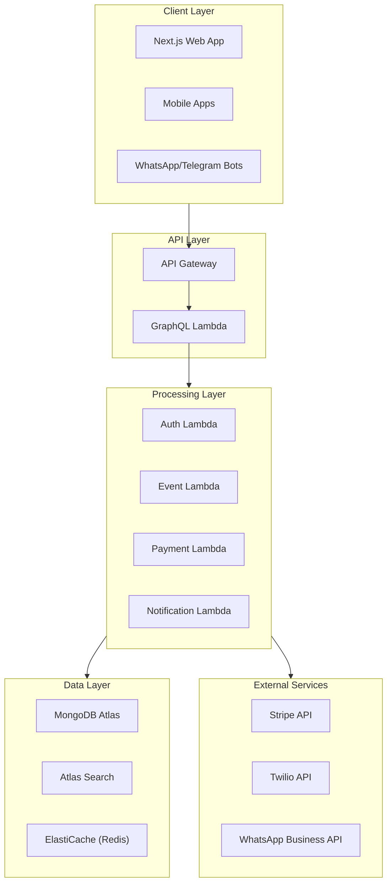
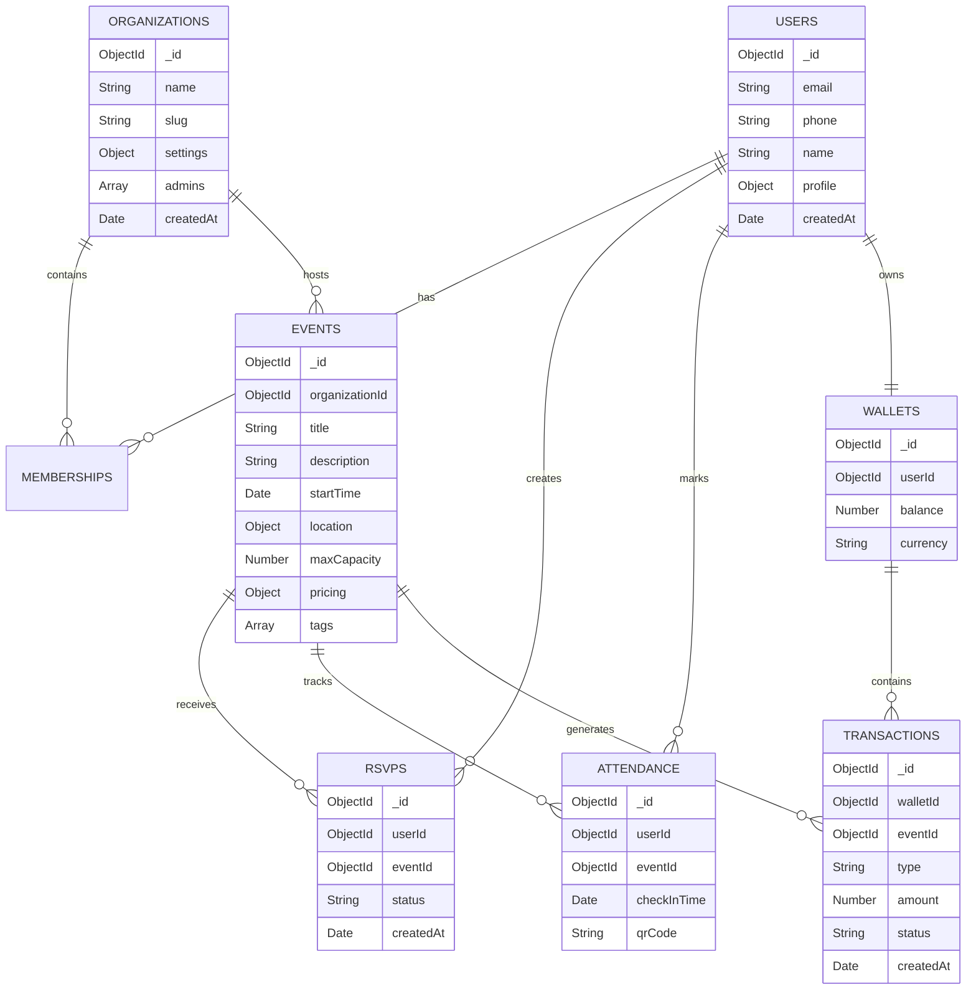
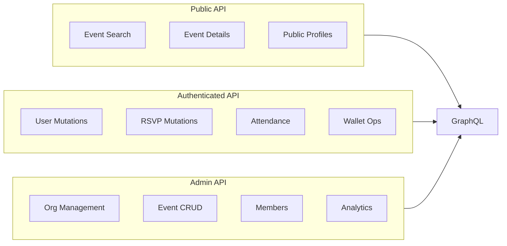
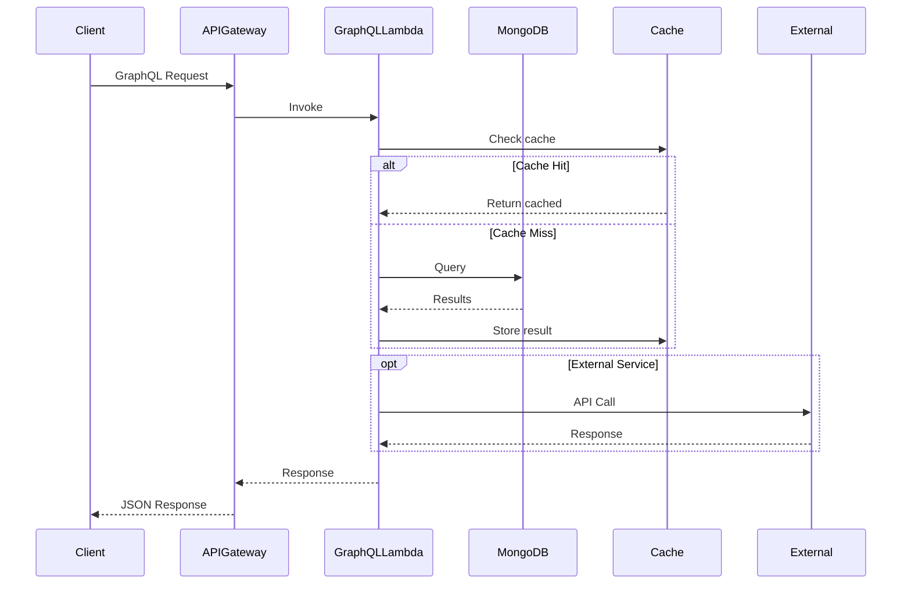
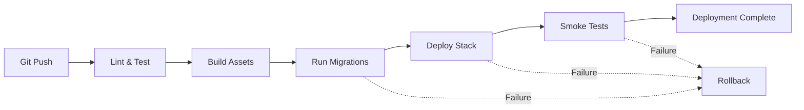
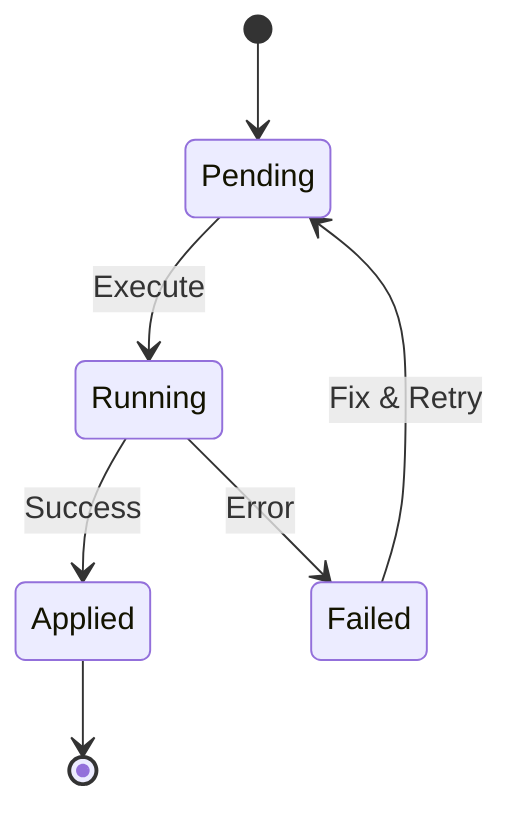

# System Design Document - Group Ops Platform v0.1

## Document Information
- **Path**: `/docs/design/system-design-v0.1.md`
- **Description**: Technical design document implementing PRD v0.3 requirements
- **Generated**: 2025-10-28
- **Maintained By**: Claude / Engineering Team
- **PRD Reference**: `/docs/prd/group-ops-platform-v0.3.md`

---

## 1. Architecture Overview

The Group Ops Platform leverages a serverless architecture on AWS, with MongoDB Atlas for data persistence and GraphQL as the API layer.

### 1.1 Core Components



### 1.2 Technology Stack

| Component | Technology | Purpose |
|-----------|------------|---------|
| **Compute** | AWS Lambda | Serverless execution |
| **API Gateway** | AWS API Gateway | HTTP/WebSocket routing |
| **API Layer** | GraphQL (Apollo Server) | Flexible querying |
| **Database** | MongoDB Atlas | Document store |
| **Search** | Atlas Search | Full-text search & facets |
| **Cache** | ElastiCache Redis | Session & query caching |
| **IaC** | CloudFormation | Infrastructure as Code |
| **CI/CD** | GitHub Actions | Automated deployments |
| **Web Framework** | Next.js 14 | SSR/SSG React app |
| **UI Components** | shadcn/ui | Component library |
| **Payments** | Stripe | Payment processing |
| **Messaging** | Twilio/WhatsApp Business | Bot communications |

---

## 2. Data Architecture

### 2.1 MongoDB Collections



### 2.2 Collection Details

| Collection | Indexes | Purpose |
|------------|---------|---------|
| **users** | email (unique), phone (unique) | User accounts |
| **organizations** | slug (unique), name (text) | Group entities |
| **events** | organizationId, startTime, status, tags (multikey) | Event records |
| **rsvps** | userId + eventId (compound unique), eventId, userId | Reservations |
| **attendance** | userId + eventId (compound), eventId, checkInTime | Check-ins |
| **memberships** | userId + organizationId (compound unique) | Group memberships |
| **wallets** | userId (unique) | Virtual wallets |
| **transactions** | walletId, eventId, createdAt | Payment records |

---

## 3. API Design

### 3.1 GraphQL Schema Overview

The GraphQL API provides a unified interface for all client operations. Schema is modularized by domain:

- **User Management**: Authentication, profiles, preferences
- **Organization Management**: Groups, memberships, roles
- **Event Management**: CRUD operations, search, filtering
- **RSVP & Attendance**: Reservations, check-ins, QR codes
- **Payments**: Wallet operations, transactions, refunds
- **Notifications**: Preferences, delivery status

### 3.2 API Boundaries



### 3.3 Authentication Flow

1. **OTP Request**: User provides phone/email
2. **OTP Validation**: 6-digit code sent via Twilio/SES
3. **JWT Generation**: 24-hour access token + 30-day refresh token
4. **Session Management**: Redis cache for active sessions

---

## 4. Service Architecture

### 4.1 Lambda Functions

| Function | Trigger | Purpose | Memory | Timeout |
|----------|---------|---------|--------|---------|
| **graphql-resolver** | API Gateway | Main GraphQL handler | 1024 MB | 30s |
| **auth-handler** | API Gateway | OTP generation/validation | 512 MB | 10s |
| **event-processor** | EventBridge | Event state changes | 512 MB | 15s |
| **payment-processor** | Stripe Webhook | Payment confirmations | 512 MB | 15s |
| **notification-sender** | SQS | SMS/Email delivery | 256 MB | 10s |
| **migration-runner** | Manual/CI | Database migrations | 512 MB | 60s |

### 4.2 Data Flow



---

## 5. Infrastructure as Code

### 5.1 CloudFormation Stack Structure

```yaml
# Stack Hierarchy
Main Stack (sandbox-stack.yml)
├── Network Stack (vpc, subnets)
├── Security Stack (IAM roles, policies)
├── API Stack (API Gateway, custom domain)
├── Lambda Stack (functions, layers)
├── Database Stack (Atlas connection, secrets)
├── Cache Stack (ElastiCache cluster)
└── Monitoring Stack (CloudWatch, alarms)
```

### 5.2 Environment Configuration

| Parameter | Sandbox | QA | Production |
|-----------|---------|-----|------------|
| **Lambda Memory** | 512 MB | 1024 MB | 2048 MB |
| **Lambda Timeout** | 15s | 30s | 30s |
| **Cache Node Type** | t3.micro | t3.small | t3.medium |
| **MongoDB Cluster** | M0 (free) | M10 | M30 |
| **API Rate Limit** | 100 req/s | 500 req/s | 2000 req/s |

---

## 6. Search Architecture

### 6.1 Atlas Search Configuration

Atlas Search provides full-text search capabilities with faceted filtering:

```json
{
  "mappings": {
    "dynamic": false,
    "fields": {
      "title": { "type": "string", "analyzer": "lucene.standard" },
      "description": { "type": "string", "analyzer": "lucene.standard" },
      "tags": { "type": "string", "analyzer": "lucene.keyword" },
      "location.city": { "type": "string", "analyzer": "lucene.keyword" },
      "startTime": { "type": "date" },
      "organizationId": { "type": "objectId" }
    }
  }
}
```

### 6.2 Search Query Flow

1. GraphQL receives search query with filters
2. Build Atlas Search aggregation pipeline
3. Apply text search, date ranges, facets
4. Return paginated results with metadata

---

## 7. CI/CD Pipeline

### 7.1 GitHub Actions Workflow



### 7.2 Deployment Steps

1. **Code Quality**: ESLint, TypeScript checks, unit tests
2. **Build**: Compile TypeScript, bundle Lambda functions
3. **Migration**: Run pending database migrations
4. **Infrastructure**: Deploy/update CloudFormation stack
5. **Validation**: Run smoke tests against deployed endpoints
6. **Notification**: Slack/email on success/failure

---

## 8. Migration Strategy

### 8.1 Migration Runner

TypeScript-based migration system with:
- Version tracking in `migrations` collection
- Automatic rollback on failure
- Dry-run mode for validation
- Atlas index synchronization

### 8.2 Migration Lifecycle



---

## 9. Security Considerations

### 9.1 Authentication & Authorization

- **OTP-based auth**: No passwords stored
- **JWT tokens**: Short-lived access (24h) + refresh (30d)
- **Role-based access**: User, Admin, SuperAdmin
- **API rate limiting**: Per-user and per-IP

### 9.2 Data Protection

- **Encryption at rest**: MongoDB Atlas encryption
- **Encryption in transit**: TLS 1.3 minimum
- **Secrets management**: AWS Secrets Manager
- **PII handling**: GDPR-compliant data retention

### 9.3 Security Headers

```yaml
Content-Security-Policy: default-src 'self'
X-Frame-Options: DENY
X-Content-Type-Options: nosniff
Strict-Transport-Security: max-age=31536000
```

---

## 10. Monitoring & Observability

### 10.1 Metrics

- **Lambda metrics**: Invocations, errors, duration, throttles
- **API metrics**: Request count, latency, 4xx/5xx rates
- **Database metrics**: Connection pool, query time, index usage
- **Business metrics**: Events created, RSVPs, attendance rate

### 10.2 Logging

- **Structured logging**: JSON format with correlation IDs
- **Log aggregation**: CloudWatch Logs Insights
- **Log retention**: 7 days (sandbox), 30 days (QA), 90 days (prod)

### 10.3 Alerting

| Alert | Threshold | Action |
|-------|-----------|--------|
| Lambda errors | >1% error rate | PagerDuty |
| API latency | p99 > 1s | Slack notification |
| Database connections | >80% pool | Auto-scale |
| Payment failures | >5 in 5 min | Email to ops |

---

## 11. Performance Optimization

### 11.1 Caching Strategy

- **GraphQL response cache**: 5 min TTL for public queries
- **Database query cache**: Redis with 15 min TTL
- **CDN**: CloudFront for static assets
- **Lambda container reuse**: Keep-warm for critical functions

### 11.2 Database Optimization

- **Compound indexes**: For common query patterns
- **Projection**: Return only required fields
- **Aggregation pipeline**: Server-side data processing
- **Connection pooling**: Reuse MongoDB connections

---

## 12. Phase 1 Implementation Scope

Per PRD v0.3, Phase 1 includes:

### 12.1 Core Features
- User registration/login (OTP-based)
- Organization creation and management
- Event CRUD operations
- RSVP functionality
- Basic attendance tracking
- Wallet creation (no payment processing)
- Transaction recording (manual only)

### 12.2 Excluded from Phase 1
- WhatsApp/Telegram bots
- Stripe payment processing
- Advanced analytics
- Waitlist management
- Multi-language support

---

## 13. Repository Mapping

This design maps to the repository structure defined in PRD v0.3:

```
/docs/design/            → This document and related diagrams
/src/api/               → GraphQL schema and resolvers
/src/models/            → MongoDB models and schemas
/infra/cloudformation/  → AWS infrastructure templates
/infra/github-actions/  → CI/CD workflows
/infra/migrations/      → Database migration scripts
/infra/atlas-indexes/   → Search index definitions
/infra/scripts/         → Utility scripts (migration runner)
```

---

## Version Control

- **Document Version**: v0.1
- **PRD Reference**: v0.3
- **Last Updated**: 2025-10-28
- **Next Review**: Upon PRD v0.4 release

This document will be updated as implementation progresses and requirements evolve.