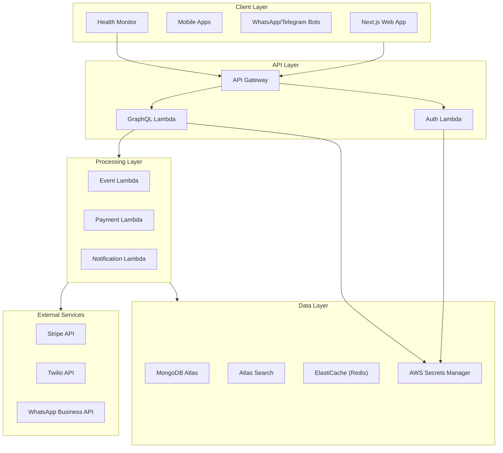
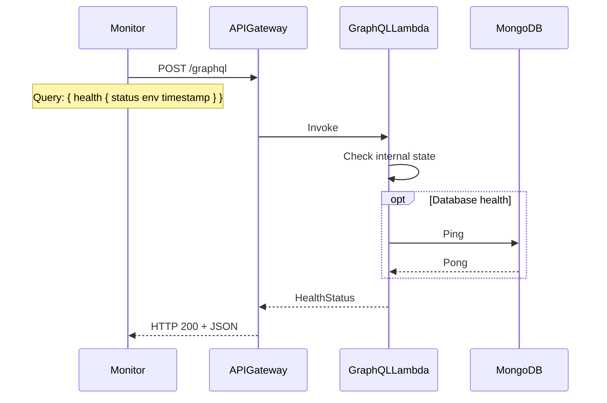
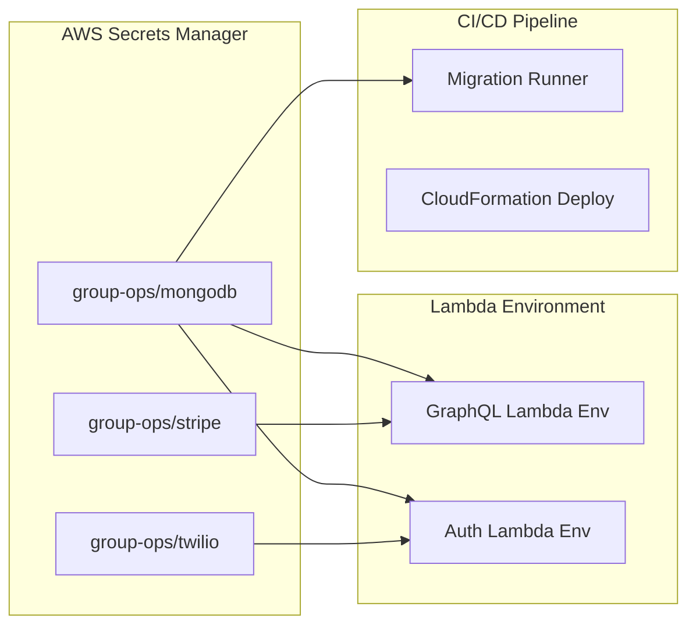
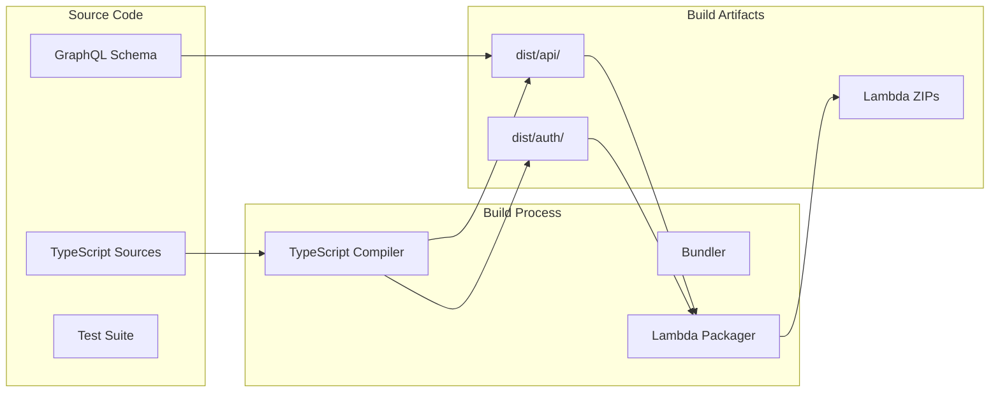
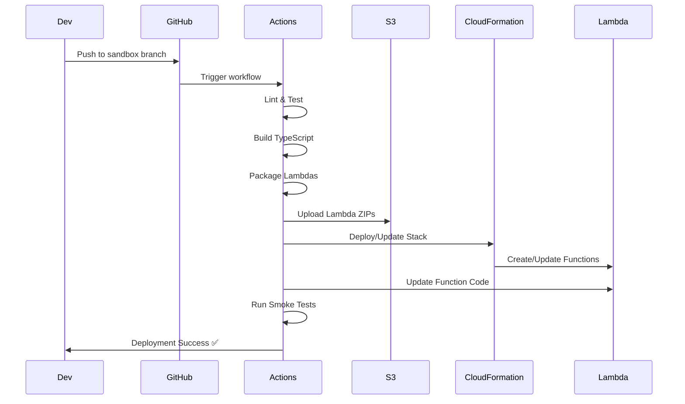
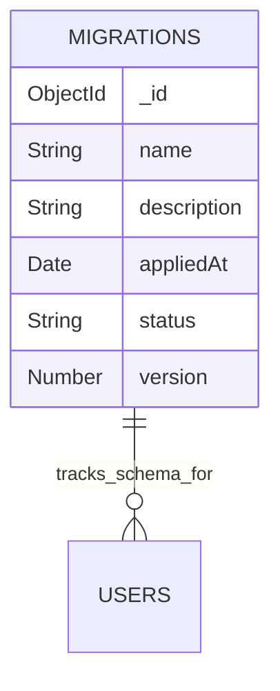
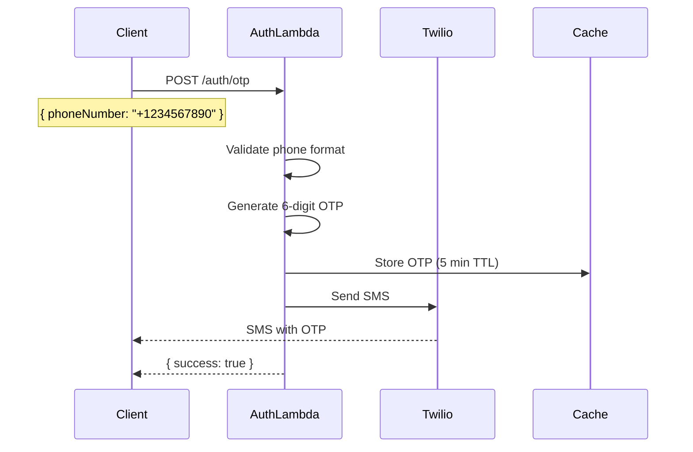
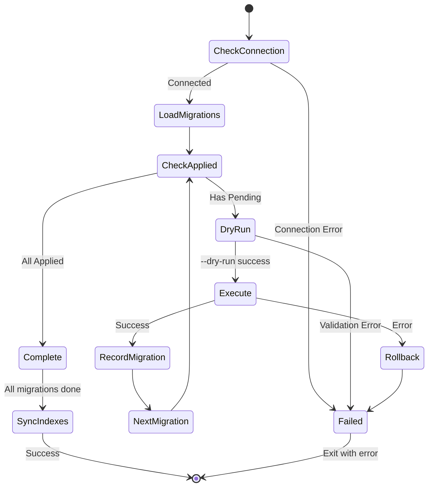

# System Design Document - Group Ops Platform v0.2

## Document Information
- **Path**: `/docs/design/system-design-v0.2.md`
- **Description**: Technical design document implementing PRD v0.4 requirements with health checks and deployment hardening
- **Generated**: 2025-10-28
- **Maintained By**: Claude / Engineering Team
- **PRD Reference**: `/docs/prd/group-ops-platform-v0.4.md`

---

## 1. Architecture Overview

The Group Ops Platform leverages a serverless architecture on AWS, with MongoDB Atlas for data persistence and GraphQL as the API layer. This version includes health monitoring and improved deployment reliability.

### 1.1 Core Components



### 1.2 Technology Stack

| Component | Technology | Purpose |
|-----------|------------|---------|
| **Compute** | AWS Lambda (Node.js 18.x) | Serverless execution |
| **API Gateway** | AWS API Gateway HTTP API | HTTP/WebSocket routing |
| **API Layer** | GraphQL (Apollo Server) | Flexible querying |
| **Database** | MongoDB Atlas | Document store |
| **Search** | Atlas Search | Full-text search & facets |
| **Cache** | ElastiCache Redis | Session & query caching |
| **Secrets** | AWS Secrets Manager | Secure credential storage |
| **IaC** | CloudFormation | Infrastructure as Code |
| **CI/CD** | GitHub Actions | Automated deployments |
| **Build** | TypeScript + TSC | Type-safe compilation |
| **Web Framework** | Next.js 14 | SSR/SSG React app |
| **UI Components** | shadcn/ui | Component library |
| **Payments** | Stripe | Payment processing |
| **Messaging** | Twilio/WhatsApp Business | Bot communications |

---

## 2. Health Monitoring & Observability

### 2.1 Health Check Query

A public GraphQL health query provides unauthenticated health monitoring:

```graphql
type HealthStatus {
  status: String!      # "ok" | "degraded" | "error"
  env: String!         # "sandbox" | "qa" | "prod"
  timestamp: DateTime!
  version: String!     # Build version/commit SHA
}

type Query {
  health: HealthStatus!
}
```

**Implementation**:
- No authentication required
- Returns current environment from `process.env.ENVIRONMENT`
- Includes build version for deployment tracking
- Used by CI/CD smoke tests and monitoring tools

### 2.2 Health Check Flow



---

## 3. Environment Configuration & Secrets

### 3.1 Environment Variables

All Lambda functions receive standardized environment configuration:

| Variable | Source | Purpose | Example |
|----------|--------|---------|---------|
| **ENVIRONMENT** | CloudFormation Parameter | Environment name | `sandbox`, `qa`, `prod` |
| **MONGODB_URI** | Secrets Manager / Parameter | Database connection | `mongodb+srv://...` |
| **REDIS_ENDPOINT** | CloudFormation Output | Cache endpoint | `cache.abc.cache.amazonaws.com` |
| **API_ENDPOINT** | CloudFormation Output | API Gateway URL | `https://xyz.execute-api.region.amazonaws.com` |
| **LOG_LEVEL** | CloudFormation Parameter | Logging verbosity | `debug`, `info`, `error` |

### 3.2 Secrets Management



**Secrets Lifecycle**:
1. **Development**: Use `.env.local` (gitignored)
2. **Sandbox**: Secrets Manager with test credentials
3. **QA/Prod**: Secrets Manager with IAM restricted access

---

## 4. Build & Deployment Architecture

### 4.1 Build Pipeline



### 4.2 Directory Structure After Build

```
dist/
├── api/
│   ├── index.js           # GraphQL handler entry
│   ├── schema.graphql      # Copied schema file
│   ├── resolvers/          # Compiled resolvers
│   └── utils/              # Helper functions
├── auth/
│   ├── index.js           # Auth handler entry
│   ├── otp.js             # OTP logic
│   └── jwt.js             # Token management
└── lambdas/
    ├── graphql.zip        # Packaged GraphQL Lambda
    └── auth.zip           # Packaged Auth Lambda
```

### 4.3 Deployment Flow



---

## 5. API Routes & Lambda Mappings

### 5.1 API Gateway Routes

| Route | Method | Lambda | Purpose | Auth Required |
|-------|--------|--------|---------|---------------|
| `/graphql` | POST | GraphQLFunction | GraphQL API | Varies by query |
| `/auth/otp` | POST | AuthFunction | Request OTP | No |
| `/auth/verify` | POST | AuthFunction | Verify OTP | No |
| `/health` | GET | GraphQLFunction | Health check | No |

### 5.2 Lambda Handler Mappings

**GraphQL Lambda** (`dist/api/index.handler`):
```typescript
// Handler signature
export const handler = async (event: APIGatewayProxyEventV2): Promise<APIGatewayProxyResultV2>
```

**Auth Lambda** (`dist/auth/index.handler`):
```typescript
// Handler signature
export const handler = async (event: APIGatewayProxyEventV2): Promise<APIGatewayProxyResultV2>
```

---

## 6. Data Architecture (Enhanced)

### 6.1 MongoDB Collections with Health Tracking

Added migration tracking collection:



### 6.2 Collection Indexes (Updated)

| Collection | Indexes | Purpose |
|------------|---------|---------|
| **_migrations** | name (unique), version | Track applied migrations |
| **users** | email (unique), phone (unique) | User accounts |
| **organizations** | slug (unique), name (text) | Group entities |
| **events** | organizationId, startTime, status, tags (multikey) | Event records |
| **rsvps** | userId + eventId (compound unique), eventId, userId | Reservations |
| **attendance** | userId + eventId (compound), eventId, checkInTime | Check-ins |
| **memberships** | userId + organizationId (compound unique) | Group memberships |
| **wallets** | userId (unique) | Virtual wallets |
| **transactions** | walletId, eventId, createdAt | Payment records |

---

## 7. Authentication & OTP Flow

### 7.1 OTP Request Flow



### 7.2 OTP Verification Flow (Stub for v0.4)

For v0.4, verification returns success for valid format:

```typescript
// Stub implementation for v0.4
if (otp.match(/^\d{6}$/)) {
  return { success: true, token: "stub-token" };
}
```

---

## 8. CI/CD Pipeline (Hardened)

### 8.1 GitHub Actions Workflow Structure

```yaml
name: Deploy Sandbox
on:
  push:
    branches: [sandbox]

jobs:
  test:
    - lint (ESLint)
    - type-check (tsc --noEmit)
    - unit-tests (Jest)

  build:
    - compile TypeScript (tsc)
    - copy static assets
    - package Lambdas (zip)

  deploy:
    - upload to S3 (unique bucket)
    - run migrations (dry-run first)
    - deploy CloudFormation
    - update Lambda code

  verify:
    - smoke test GraphQL health
    - smoke test Auth endpoint
    - check CloudWatch logs
```

### 8.2 S3 Bucket Naming Strategy

To avoid global namespace collisions:

```bash
BUCKET_NAME="group-ops-lambda-${ENVIRONMENT}-${GITHUB_REPOSITORY_OWNER}"
# Example: group-ops-lambda-sandbox-acmecorp
```

---

## 9. Migration Strategy (v0.4 Enhanced)

### 9.1 Migration Runner Contract

**Required npm scripts**:
```json
{
  "scripts": {
    "build": "tsc -p tsconfig.json",
    "migrate:dry-run": "ts-node infra/scripts/migration-runner.ts --dry-run",
    "migrate:up": "ts-node infra/scripts/migration-runner.ts up",
    "sync:search-indexes": "ts-node infra/scripts/migration-runner.ts sync-search",
    "lint": "eslint .",
    "type-check": "tsc --noEmit",
    "test:unit": "jest --runInBand"
  }
}
```

### 9.2 Migration Execution Flow



---

## 10. Security Considerations (v0.4 Updates)

### 10.1 Repository Security

**CONTRIBUTING.md Requirements**:
- Never commit `.env*` files
- Never commit `.claude/` directories
- Never commit real credentials
- All secrets via AWS Secrets Manager
- All infrastructure changes via CloudFormation

### 10.2 Lambda Security Configuration

```yaml
# CloudFormation Lambda configuration
Environment:
  Variables:
    ENVIRONMENT: !Ref Environment
    MONGODB_URI: !Sub '{{resolve:secretsmanager:group-ops/mongodb:SecretString}}'
    NODE_OPTIONS: '--enable-source-maps'
```

### 10.3 API Gateway Security

- Rate limiting: 100 req/s (sandbox), 500 req/s (QA), 2000 req/s (prod)
- CORS configuration for known origins only
- API key required for admin operations (future)

---

## 11. Monitoring & Observability (v0.4)

### 11.1 CloudWatch Metrics

**Custom Metrics**:
- `HealthCheck.Success`: Count of successful health checks
- `HealthCheck.Latency`: Health check response time
- `OTP.Requested`: OTP requests per minute
- `OTP.Verified`: Successful verifications

### 11.2 Alarms

| Alarm | Threshold | Period | Action |
|-------|-----------|--------|--------|
| HealthCheckFailure | 3 consecutive failures | 1 min | SNS notification |
| LambdaColdStart | >1s init duration | 5 min | Log to dashboard |
| OTPRateLimit | >10 requests/min/phone | 1 min | Block in Lambda |

---

## 12. Phase 1.1 Implementation Scope (v0.4)

### 12.1 New in v0.4
- ✅ Health check GraphQL query
- ✅ Build pipeline with TypeScript compilation
- ✅ Lambda packaging from `dist/` directory
- ✅ Environment variables in Lambda configuration
- ✅ OTP handler stub implementation
- ✅ Unique S3 bucket naming
- ✅ Migration runner npm scripts
- ✅ CONTRIBUTING.md with security rules

### 12.2 Deployment Checklist

Before deploying to sandbox:
1. [ ] Run `npm run lint`
2. [ ] Run `npm run type-check`
3. [ ] Run `npm run test:unit`
4. [ ] Run `npm run build`
5. [ ] Verify `dist/` contains compiled JS
6. [ ] Run `npm run migrate:dry-run`
7. [ ] Push to `sandbox` branch
8. [ ] Monitor GitHub Actions
9. [ ] Test health endpoint

---

## 13. Repository Mapping (v0.4)

Updated repository structure with new artifacts:

```
/docs/
  /design/
    system-design-v0.1.md
    system-design-v0.2.md     ← This document
  /prd/
    group-ops-platform-v0.4.md
    changelog.md

/src/
  /api/
    schema.graphql            ← Added health query
    graphql-handler.ts        ← New: Handler implementation
  /auth/
    otp-handler.ts           ← New: Auth implementation

/dist/                       ← Generated by build
  /api/
  /auth/
  /lambdas/

/infra/
  /cloudformation/
    sandbox-stack.yml        ← Updated with env vars
  /github-actions/
    deploy-sandbox.yml       ← Updated build process
  /migrations/
    init-schema.ts
  /atlas-indexes/
    events.json
  /scripts/
    migration-runner.ts

package.json                 ← New: Build scripts
tsconfig.json               ← New: TypeScript config
CONTRIBUTING.md             ← New: Security guidelines
```

---

## Version Control

- **Document Version**: v0.2
- **PRD Reference**: v0.4
- **Last Updated**: 2025-10-28
- **Next Review**: Upon PRD v0.5 release

This document implements all requirements from PRD v0.4 for sandbox deployment hardening.